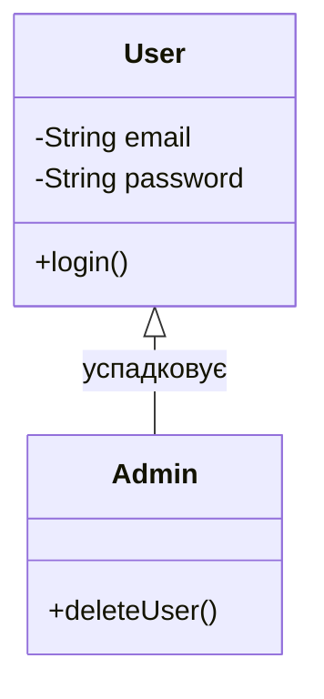

Допомагає спланувати ієрархію класів перед написанням коду.

```
classDiagram
    class User {
        -String email
        -String password
        +login()
    }
    class Admin {
        +deleteUser()
    }
    User <|-- Admin : успадковує
```

---



---
### Пояснення елементів схеми:

1. **`class User { ... }` та `class Admin { ... }`** — **Визначення класів.**
    
    - Це базові шаблони для створення об'єктів. В Obsidian вони виглядають як прямокутники, розділені на секції: назва, атрибути (поля) та операції (методи).
        
2. **Модифікатори доступу (`-` та `+`):**
    
    - **`-String email`** — символ мінус позначає **private**. Це означає, що доступ до поля можливий тільки всередині самого класу `User` (принцип інкапсуляції).
        
    - **`+login()`** — символ плюс позначає **public**. Цей метод доступний для виклику з будь-якої іншої частини програми.
        
3. **Типи даних та методи:**
    
    - **`String email`** — вказує, що поле зберігає текстові дані.
        
    - **`login()`** — метод (функція), яка описує поведінку об'єкта.
        
4. **`User <|-- Admin`** — **Успадкування (Inheritance).**
    
    - Це один із найважливіших символів у UML. Стрілка з порожнім трикутником `<|--` вказує від нащадка до батька.
        
    - У Java це відповідає ключовому слову **`extends`** (`public class Admin extends User`).
        
    - Це означає, що `Admin` автоматично отримує всі поля та методи класу `User` (email, password, login), але може мати свої власні.
        
5. **`: успадковує`** — **Підпис зв'язку.**
    
    - Текст після двокрапки додає пояснення до лінії, щоб архітектура була зрозумілою навіть без глибоких знань UML-символів.
        

---

### Практичне значення для твого навчання:

- **Планування ООП:** Ти одразу бачиш ієрархію. Наприклад, якщо ти захочеш додати клас `Moderator`, ти просто проведеш ще одну лінію `<|--` від `User`.
    
- **Чистий код:** Якщо ти помітиш, що у двох класів забагато спільних полів, це сигнал, що їх треба винести у спільний батьківський клас (як у прикладі з `User`).
    
- **Spring Security:** Такі схеми допомагають візуалізувати ролі користувачів, що дуже важливо для налаштування доступу до ендпоінтів.

---
# Типи зв'язку
### 1. Спадкування (Inheritance / Generalization)

Використовується, коли один клас є підтипом іншого. Наприклад, "Кіт" є "Твариною".

- **Синтаксис:** `<|--`
    
- **Приклад:** `Animal <|-- Cat`
    
### 2. Реалізація (Realization)

Показує, що клас реалізує інтерфейс або абстрактні методи.

- **Синтаксис:** `<|..`
    
- **Приклад:** `Interface <|.. Class`
    
### 3. Композиція (Composition)

Сильний зв'язок "частина-ціле", де частини не можуть існувати без цілого. Якщо видалити головний об'єкт, видаляться і його компоненти (наприклад, "Кімната" в "Будинку").

- **Синтаксис:** `*--`
    
- **Приклад:** `House *-- Room`
    
### 4. Агрегація (Aggregation)

Слабший зв'язок "частина-ціле". Компоненти можуть існувати самостійно (наприклад, "Гравці" в "Команді").

- **Синтаксис:** `o--`
    
- **Приклад:** `Team o-- Player`
    
### 5. Асоціація (Association)

Звичайний зв'язок між класами, що вказує на їхню взаємодію. Буває одностороннім або двостороннім.

- **Синтаксис:** `--` (суцільна лінія) або `-->` (зі стрілкою)
    
- **Приклад:** `Teacher -- Student`
    
### 6. Залежність (Dependency)

Вказує на те, що один клас використовує інший (наприклад, як аргумент методу). Це найслабший тип зв'язку.

- **Синтаксис:** `..>`
    
- **Приклад:** `ClassA ..> ClassB`

---

#побудоваДіаграми #mermaid 