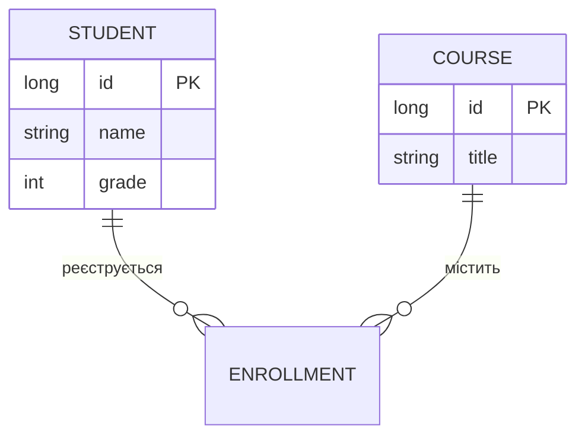

Для візуалізації структури твоїх таблиць у PostgreSQL.

```
erDiagram
    STUDENT ||--o{ ENROLLMENT : "реєструється"
    COURSE ||--o{ ENROLLMENT : "містить"
    STUDENT {
        long id PK
        string name
        int grade
    }
    COURSE {
        long id PK
        string title
    }
```

---



---
### Пояснення елементів схеми:

1. **`STUDENT { ... }` та `COURSE { ... }`** — **Сутності (Entities).**
    
    - У контексті бази даних — це ваші таблиці. У Java (Spring Boot) — це ваші класи-сутності (`@Entity`).
        
    - Фігурні дужки містять перелік атрибутів (колонок таблиці).
        
2. **`long id PK`** — **Первинний ключ (Primary Key).**
    
    - Позначка `PK` вказує на унікальний ідентифікатор запису. Використання типу `long` є стандартом для великих таблиць у PostgreSQL.
        
3. **`STUDENT ||--o{ ENROLLMENT`** — **Тип зв'язку (Relationship).**
    
    - Це найважливіша частина. Символи на кінцях лінії означають "кардинальність":
        
        - **`||`** (з боку Student) — означає "один і тільки один". Тобто запис у таблиці реєстрацій мусить належати конкретному студенту.
            
        - **`o{`** (з боку Enrollment) — означає "нуль або багато". Студент може не мати жодної реєстрації, а може мати їх десяток.
            
    - Разом це зв'язок **Один-до-Багатьох** (One-to-Many).
        
4. **`ENROLLMENT`** — **Асоціативна сутність (Таблиця зв'язку).**
    
    - Хоча вона не розписана детально в блоці `{ }`, вона виступає посередником. Оскільки один студент може бути на багатьох курсах, а один курс містить багато студентів, виникає зв'язок "Багато-до-Багатьох", який реалізується через цю проміжну таблицю.
        
5. **`"реєструється"` та `"містить"`** — **Опис ролі.**
    
    - Текст у лапках пояснює дію, яка пов'язує таблиці, що робить схему читабельною навіть для тих, хто не бачив код.

---
### Чому це важливо для твого проекту:

- **Проектування БД:** Перш ніж писати `CREATE TABLE`, ти малюєш таку схему в Obsidian. Це допомагає уникнути помилок у логіці.
    
- **Hibernate/JPA:** Ця діаграма прямо підказує, де ставити анотацію `@OneToMany`, а де `@ManyToOne`.
    
- **SQL Join:** Дивлячись на схему, ти одразу розумієш, як писати `JOIN`, щоб отримати список курсів конкретного студента.

---
#побудоваДіаграми #mermaid 