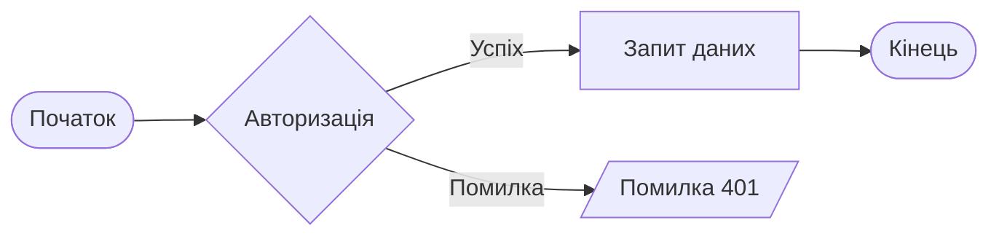

Використовуй для візуалізації логіки методів у Java або бізнес-процесів.

```
flowchart LR
    Start([Початок]) --> Auth{Авторизація}
    Auth -- Успіх --> GetData[Запит даних]
    Auth -- Помилка --> Error[/Помилка 401/]
    GetData --> End([Кінець])
```

---



---
### Пояснення елементів схеми:

1. **`Start([Початок])`** — **Початкова точка.**

    - Використання закруглених дужок `([ ... ])` позначає "термінатор" — початок або кінець процесу. Це вхід у ваш метод або запуск скрипта.

2. **`Auth{Авторизація}`** — **Блок прийняття рішення (Decision).**
    
    - Фігурні дужки `{ ... }` створюють ромб. Це логічна розв'язка (наприклад, оператор `if` або `switch` у Java). Програма перевіряє умову: "Чи правильні дані ввів користувач?".
        
3. **`Auth -- Успіх --> GetData`** — **Позитивний сценарій.**
    
    - Якщо умова в ромбі виконується (true), потік іде за стрілкою з підписом "Успіх".
        
4. **`GetData[Запит даних]`** — **Процес (Action).**
    
    - Звичайні квадратні дужки `[ ... ]` позначають стандартну дію або крок виконання. У цьому випадку — виклик методу для отримання інформації з бази даних або API.
        
5. **`Auth -- Помилка --> Error`** — **Негативний сценарій.**
    
    - Якщо авторизація не пройшла (false), потік переривається і переходить до обробки помилки.
        
6. **`Error[/Помилка 401/]`** — **Дані або Вивід (Input/Output).**
    
    - Похилі дужки `[/ ... /]` (паралелограм) зазвичай використовуються для позначення вводу або виводу даних. Тут це вивід повідомлення про помилку доступу (Unauthorized).
        
7. **`End([Кінець])`** — **Завершення процесу.**
    
    - Логічне завершення алгоритму. Після виконання запиту даних або після виводу помилки програма припиняє роботу в межах цієї задачі.

---

![[flowchartSyntax.jpg]]

---
### Чому це важливо для Backend-розробника (Java/Spring Boot):

- **Проектування API:** Ти бачиш, скільки запитів до бази даних робить один вхідний запит. Якщо їх забагато — це сигнал до оптимізації.
    
- **Робота з JWT:** Ти чітко бачиш, на якому етапі генерується токен і куди він повертається.
    
- **Документація:** В Obsidian така діаграма ідеально доповнює опис твоїх контролерів.
    

### Порівняння з Flowchart:

- **Flowchart** показує **ЩО** відбувається (кроки алгоритму).
    
- **Sequence Diagram** показує **ХТО** з **КИМ** і в якому **ПОРЯДКУ** спілкується.

---
#побудоваДіаграми #mermaid 