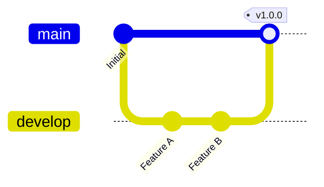

Для візуалізації стратегії роботи з гілками в командних проектах.

```
gitGraph
    commit id: "Initial"
    branch develop
    checkout develop
    commit id: "Feature A"
    commit id: "Feature B"
    checkout main
    merge develop tag: "v1.0.0"
```

---



---
### Пояснення елементів схеми:

1. **`commit id: "Initial"`** — **Створення базової точки.**
    
    - Кільце на лінії позначає збережений стан коду. Параметр `id` дозволяє підписати цей коміт (наприклад, "Initial commit").
        
2. **`branch develop`** — **Створення нової гілки.**
    
    - Ця команда створює копію коду з поточної точки. Гілка `develop` зазвичай використовується як "майданчик", де розробники збирають усі нові фічі перед релізом.
        
3. **`checkout develop`** — **Перемикання контексту.**
    
    - Ця дія переносить "покажчик" (HEAD) на гілку `develop`. Усі наступні коміти тепер будуть з'являтися саме на цій лінії, не змінюючи гілку `main`.
        
4. **`commit id: "Feature A"` та `"Feature B"`** — **Ітеративна розробка.**
    
    - Це ваші невеликі кроки роботи: створення БД, налаштування Spring Security тощо. Вони відбуваються паралельно до основної стабільної версії коду.
        
5. **`checkout main`** — **Повернення до стабільної гілки.**
    
    - Перед тим як оновити "виробничий" код, ви повертаєтесь на головну гілку.
        
6. **`merge develop tag: "v1.0.0"`** — **Злиття та Реліз.**
    
    - Команда `merge` приєднує всі зміни з `develop` до `main`.
        
    - Параметр `tag: "v1.0.0"` створює "мітку" версії. Це важливий етап у розробці, щоб завжди можна було повернутися до конкретної стабільної версії проекту.
        

---

### Чому це важливо для твого Fullstack-шляху:

- **Безпека коду:** Ти вчишся ніколи не писати код прямо в `main`. Якщо щось піде не так у `develop`, твій основний проект залишиться робочим.
    
- **Робота в команді:** Коли ти працюватимеш із друзями над проектами (як "Еко-школа"), ви зможете створювати окремі гілки для кожного учасника.
    
- **Візуалізація в Obsidian:** Якщо ти забув, як розвивався твій проект місяць тому, такий графік у нотатках миттєво освіжить пам'ять.

---
#побудоваДіаграми #mermaid 