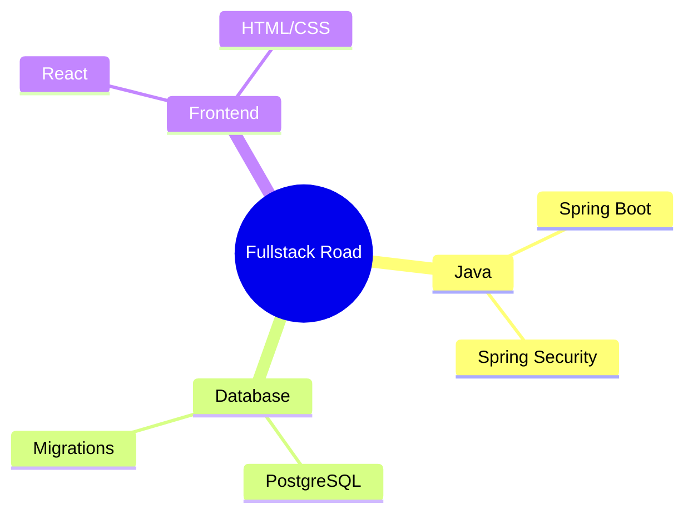

Для твого **Obsidian MOC** (Map of Content), щоб бачити дерево знань.

```
mindmap
    root((Fullstack Road))
        Java
            Spring Boot
            Spring Security
        Database
            PostgreSQL
            Migrations
        Frontend
            React
            HTML/CSS
```

---



---
### Пояснення елементів схеми:

1. **`root((Fullstack Road))`** — **Центральна ідея (Корінь).**
    
    - Подвійні дужки `(( ... ))` створюють коло в центрі карти. Це твоя глобальна мета. У Mermaid це вузол нульового рівня, від якого розходяться всі інші гілки.
    
2. **`Java`, `Database`, `Frontend`** — **Гілки першого рівня (Ключові домени).**
    
    - Це головні категорії твого навчання. У ментальних картах вони допомагають розділити велику задачу на логічні блоки, які не перетинаються, щоб мозок не перевантажувався.
    
3. **`Spring Boot`, `Spring Security` (в гілці Java)** — **Вузька спеціалізація.**
    
    - Це деталізація твого стеку. У Mermaid відступи (Tab або пробіли) визначають вкладеність. Чим більше відступів, тим глибша деталізація теми.
    
4. **`PostgreSQL`, `Migrations` (в гілці Database)** — **Технічні навички.**
    
    - Це конкретні інструменти, які ти маєш опанувати в межах домену баз даних. Це рівень "дій", які можна перетворити на окремі навчальні сесії.
    
5. **`React`, `HTML/CSS` (в гілці Frontend)** — **Візуальна частина.**
    
    - Опис технологій, що відповідають за інтерфейс. Розміщення їх на одній карті з Java та DB дозволяє бачити повну картину твого проекту (наприклад, "Еко-школа"), де всі ці частини мають працювати разом.

---

### Чому це ідеально для твого Obsidian:

- **Maps of Content (MOC):** Ти можеш зробити цей Mindmap інтерактивним. В Obsidian кожен пункт карти може бути посиланням на відповідну нотатку (наприклад, `[[Spring Boot]]`).
    
- **Візуалізація прогресу:** Ти можеш змінювати колір або додавати іконки до гілок, які ти вже вивчив.
    
- **Структурування хаосу:** Коли тем стає занадто багато (як у 9-му класі з біологією, географією та програмуванням), така карта допомагає "вивантажити" структуру з голови на екран.
    

---
### Порада щодо синтаксису:

У Mermaid Mindmap форми вузлів можна змінювати прямо в тексті:

- `root((Коло))`
    
- `node[Прямокутник]`
    
- `node)Хмара(`
    
- `node{{Шестикутник}}`

---
#побудоваДіаграми #mermaid 