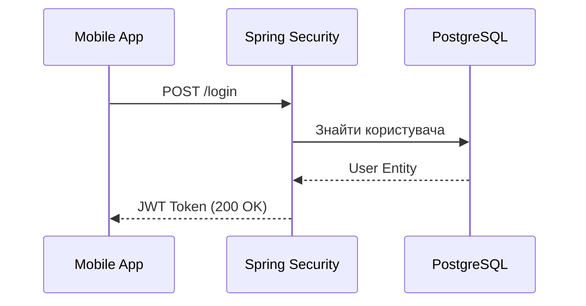

Ідеально для проектування REST API та того, як Frontend спілкується з Backend.

```
sequenceDiagram
    participant App as Mobile App
    participant Auth as Spring Security
    participant DB as PostgreSQL

    App->>Auth: POST /login
    Auth->>DB: Знайти користувача
    DB-->>Auth: User Entity
    Auth-->>App: JWT Token (200 OK)
```

---



---
### Пояснення елементів схеми:

1. **`participant App as Mobile App`** — **Учасники (Об'єкти).**
    
    - Ключове слово `participant` створює "лінію життя" (вертикальну пунктирну лінію).
        
    - Конструкція `as` дозволяє використовувати короткий псевдонім (`App`) у коді, але відображати зрозумілу назву ("Mobile App") на самій діаграмі.
        
2. **`App->>Auth: POST /login`** — **Синхронний запит.**
    
    - Суцільна лінія з товстою стрілкою `->>` означає виклик операції.
        
    - Тут Мобільний додаток ініціює процес, відправляючи HTTP-запит до вашого Backend-сервера (Spring Security).
        
3. **`Auth->>DB: Знайти користувача`** — **Звернення до сервісу/БД.**
    
    - Сервер не має даних у пам'яті, тому він робить наступний виклик — звертається до PostgreSQL.
        
    - У Java це зазвичай виклик методу репозиторію `userRepository.findByEmail()`.
        
4. **`DB-->>Auth: User Entity`** — **Повернення даних (Response).**
    
    - Пунктирна лінія з відкритою стрілкою `-->>` позначає повернення результату попереднього запиту.
        
    - База даних повертає запис про користувача (Entity) серверу для подальшої перевірки пароля.
        
5. **`Auth-->>App: JWT Token (200 OK)`** — **Фінальна відповідь клієнту.**
    
    - Це завершальний етап. Сервер згенерував токен і відправив його назад клієнту.
        
    - Клієнт отримує статус 200 OK, що означає успішне завершення всієї ланцюгової взаємодії.

---
### Чому це корисно для твоїх нотаток:

На відміну від Flowchart (який показує логіку "якщо/то"), **Sequence Diagram** показує архітектурні зв'язки. Це допомагає зрозуміти:

- Які компоненти системи задіяні.
    
- У якому порядку вони спілкуються.
    
- Де саме може виникнути затримка (наприклад, якщо запит до БД триває занадто довго).

---
#побудоваДіаграми #mermaid 